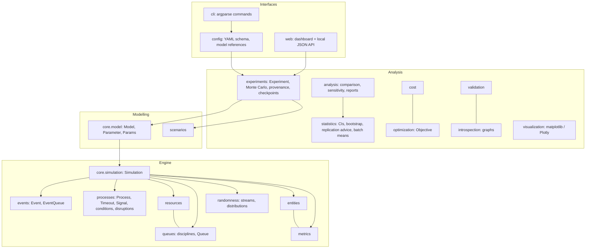

# Architecture

## Layers



Dependencies point downwards only: the engine knows nothing about
experiments, experiments know nothing about the CLI, and optional libraries
(matplotlib, Plotly, pandas, pyarrow) are imported lazily inside the
functions that need them.

| Package | Responsibility |
|---|---|
| `core` | `Clock`, `Simulation` (scheduling, run loop, registries, snapshot), `Model`, event log |
| `events` | `Event`, `EventStatus`, `Priority`, the heap-based `EventQueue` |
| `processes` | generator processes, `Timeout`, `Signal`, `AllOf`/`AnyOf`, interrupts, failure/disruption primitives |
| `resources` | `Resource`, `Request` (priorities, reneging, capacity changes, downtime) |
| `queues` | `OrderedBuffer` disciplines, blocking `Queue` |
| `entities` | `Entity` with attributes, state and history |
| `randomness` | `RandomStream` (PCG64), named sub-streams, distributions and their config specs |
| `metrics` | `Tally`, `TimeWeighted`, `Counter`, the `Metrics` registry |
| `scenarios` | `Scenario`, `grid`, `one_at_a_time` |
| `experiments` | `Experiment`, `ExperimentResult`, `monte_carlo`, provenance |
| `statistics` | intervals, bootstrap, replication advice, convergence, batch means, differences |
| `analysis` | scenario comparison, sensitivity analysis, text tables |
| `cost`, `optimization` | cost/revenue models, `Objective` adapter |
| `validation`, `introspection` | model checks, flow/state graphs, inventory |
| `serialization` | JSON/CSV/Parquet I/O, path-safety helpers |
| `config`, `cli`, `web` | YAML experiments, command line, dashboard server |

## The engine

* **Time** is a float. `Clock` converts `timedelta`/`datetime` at the API
  boundary only, so the hot loop never handles calendar objects.
* **Event queue**: a binary heap of `(time, priority, sequence, event)`
  tuples. The unique, increasing sequence number makes ordering total and
  deterministic and means events are never compared. Cancelling or
  rescheduling marks the old heap entry stale (O(1)); stale entries are
  dropped when they surface. `pop_due(horizon)` lets `run(until=...)` stop
  without re-inserting events, which would perturb ordering.
* **Processes** are generators driven by `Process._step`. Each `yield` is
  coerced to a `Waitable`. If it has already triggered (e.g. a resource unit
  was free) the process continues immediately without an event. Otherwise the
  process registers a callback. Waitables triggered from inside model code
  resume their waiters through a zero-delay event rather than synchronously,
  so a `release()` in one process never re-enters another generator.
  Timeouts fire as top-level events and resume their waiter directly (one
  heap operation per hold).
* **Resources** grant units synchronously on `request`/`release`. Only the
  resumption of the waiting process is deferred. This avoids "stealing", where
  a newcomer takes a unit that was just released for someone already waiting.
* **Statistics** are collected incrementally: Welford updates for tallies,
  integrals for time-weighted levels. Raw observations (for quantiles) and
  step series (for plots) are optional (`keep_values`, `record_series`).

## Reproducibility design

* A `Simulation` owns a root `RandomStream(seed)`; `sim.stream(name)` derives
  a child from `SeedSequence(seed, spawn_key=crc32(name))`. Streams therefore
  depend only on `(seed, name)` - not on creation order or on how many
  numbers other streams consumed.
* An experiment derives replication seeds from `(experiment seed,
  replication index)` - and, without common random numbers, the scenario
  name. Each replication is self-contained, so serial, parallel and resumed
  (checkpointed) runs produce identical records.
* `SimulationResult` and `ReplicationRecord` store the seed they used, so any
  single replication can be re-run in isolation for debugging.

## Parallelism

`Experiment(workers=N)` uses `concurrent.futures.ProcessPoolExecutor`. The
model is pickled by reference (module + qualified name); models loaded from
files by the CLI are re-imported in each worker by an initializer. Results
come back in task order. Start-up cost (about a second with the `spawn`
start method used on macOS and Windows) makes parallelism worthwhile only when
replications take longer than that. `Experiment.run(executor=...)` accepts
any other `concurrent.futures.Executor` (a Dask cluster's, for example).
See [benchmarks](https://github.com/Yashjindal11/simulsi/blob/main/benchmarks/README.md).

## Checkpointing

There are two levels:

* **Experiments** - `Experiment.run(checkpoint="file.jsonl")` appends each
  completed replication and skips completed ones on restart, after checking
  that the experiment definition (model, version, seed, scenarios) matches.
* **Running simulations** - `sim.save_checkpoint(path)` /
  `Simulation.load_checkpoint(path)`. A simulation's state includes
  suspended Python generators, which cannot be serialised reliably, so the
  checkpoint records how to rebuild the state instead: model reference,
  resolved parameters, seed, options, number of events executed and clock.
  Restoring rebuilds the model and deterministically replays exactly that
  many events. It then verifies the pending-event count, the next event time
  and a digest of all statistics, so a non-deterministic or modified model is
  reported instead of silently diverging.

```py
sim = model.create(params, seed=7)
sim.run(until=10_000)
sim.save_checkpoint("day1.ckpt.json")
...
sim = Simulation.load_checkpoint("day1.ckpt.json")   # or load_checkpoint(path, model=model)
sim.run(until=20_000)                                 # identical to an uninterrupted run
```

The costs are honest ones: restoring takes about as long as running to the
checkpoint, the simulation must come from `Model.create`, and changes made
from outside the event loop between runs are not recorded (schedule them as
events instead). Built-in models, module-level models and models loaded from
files are found automatically; otherwise pass `model=`.

## Performance

The engine is pure Python. Measured numbers are in
[benchmarks/README.md](https://github.com/Yashjindal11/simulsi/blob/main/benchmarks/README.md). Practical guidance:

* Prefer `yield number` / `sim.use(...)` in processes; avoid creating
  entities you never inspect.
* For long runs set `keep_values=False`, `record_series=False` and
  `keep_entity_history=False` (the built-in `mmc` model does).
* Use `trace=True` only when you need the event log (or cap it with
  `max_log_records`).
* Run independent replications in parallel; vectorise Monte Carlo models.

## Known limitations

* Continuous quantities are piecewise linear (`Level`); there is no ODE
  or system-dynamics integrator. State-based waits (`sim.wait_until`)
  without `on=` re-check their predicate after every event, so many
  such pending predicates slow a run down.
* Flow and state graphs are observed from a run, not derived statically.
* Sobol indices assume independent inputs; correlated inputs need other methods.
* The built-in optimiser and Gaussian-process surrogate are meant for
  small boxes (a handful of parameters, tens to a few hundred runs); the GP
  costs O(n^3) in the number of runs.
* Checkpoint restore replays the run, so it costs about the time to reach the
  checkpoint.
